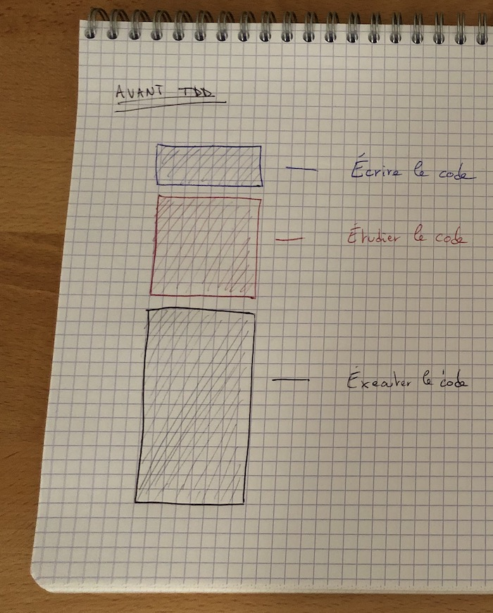
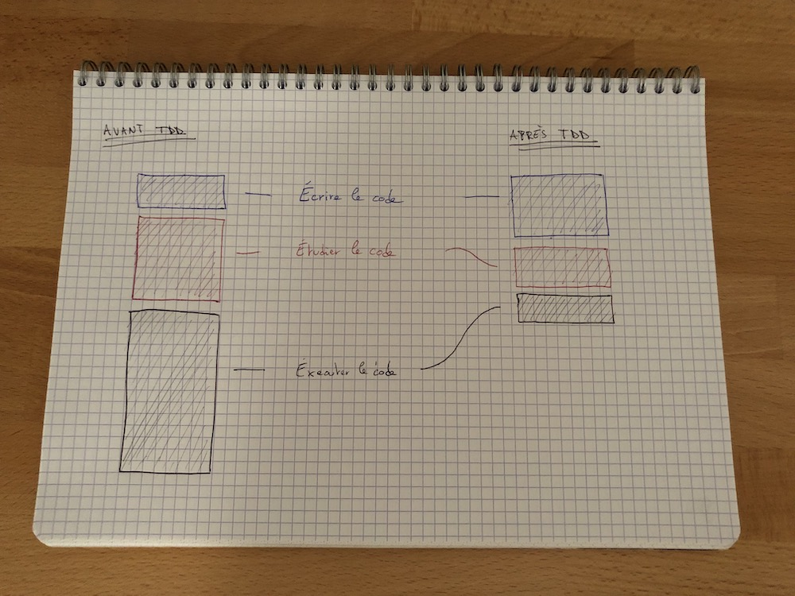

Dans [l'article précédent](la-seule-architecture-qui-compte), je te parlais de ce qu'est une architecture logicielle et de la nécessité de la faire émerger.

Pour y arriver, il faut manipuler son code comme de la __pâte à modeler__ ; car avoir une conception qui tape dans le mille du premier coup est proche de l'impossible.

Qui dit manipuler son code dit potentiellement introduire des _bugs_, casser des choses.

Pour s'en prémunir il n'y a pas 36 solutions, __il faut tester__.

Dans cet article, je vais parler de plusieurs _stratégies_ pour à la fois prévenir l'apparition de bugs mais aussi permettre de faire émerger une architecture saine et évolutive.

En somme, l'objectif est toujours d'avoir la conception la plus optimale possible pour répondre au besoin présent ; sans sur-ingénierie (pas de code "au cas où") et sans sous-ingénierie (pas de duplication partout).

__Une conception aux petits oignons pour apporter de la valeur MAINTENANT.__

Voici la liste des stratégies que je vais développer :
- tester manuellement,
- laisser le compilateur tester pour moi,
- automatiser mes tests.

<!--more-->

## Tester manuellement

Cette pratique est la plus répandue.

Après avoir écrit un bout de code, tu exécutes ton app (avec ou sans le debugger) et tu vérifies qu'elle fonctionne. Facile non ?

> Simple comme bonjour oui !

Es-tu sûr que ce soit si simple ?

> Je le fais tous les jours, ce n'est pas compliqué !

Effectivement, cette pratique n'a __rien de compliqué à première vue__, il suffit d'utiliser le logiciel que l'on crée.

Elle a l'avantage d'être simple à mettre en œuvre, un clic ou un raccourci clavier et le tour est joué !

Sous cette simplicité apparente se cache cependant une grande complexité.

Imagine que la fonctionnalité que tu vas tester à la main se trouve au fin fond de ton app et qu'elle nécessite de communiquer avec un autre logiciel (au hasard, un webservice !) dont tu ne maîtrises pas le comportement.

Ajoute à cela, par exemple, la nécessité d'être physiquement géolocalisé dans un lieu bien précis, l'utilisation de capteurs comme le Bluetooth et tu obtiens un test manuel qui est autrement plus complexe à mettre en œuvre.

Et pour le plaisir, pourquoi ne pas aussi tester différents cas de figures : que se passe-t-il si je suis au mauvais endroit ? Et si je n'ai pas de Bluetooth ? Et que le webservice est lent ? Et s'il ne répond pas ? Ou qu'il répond mais avec une erreur ? Ou qu'il répond avec succès mais sans les bonnes infos ?

Et maintenant dis-toi que pour éviter les regressions il faut faire tous ces tests à la main __à chaque fois que le code change !__ 😨

> Effectivement, je n'avais pas vu ça comme ça. Mais du coup...tu fais comment ?

Je n'ai pas de recette miracle, tu as trois options :
1. tu te prends le temps de tout tester à la main tout le temps,
2. tu travailles avec une armée de testeurs et testeuses,
3. tu laisses les utilisateurs et utilisatrices finaux tester.

### Je teste moi-même à la main

Cette option est longue...trèèèès longue, et franchement pas amusante ! Tu te vois, toi, tester tout ça à chaque fois que tu relances ton app ? Ce n'est pas viable.

Clairement, personne ne le fait et je le comprends parfaitement ! Je ne le fais pas non plus.

Pourtant, si on veut être confiant sur ce que l'on réalise, c'est ce qu'il __faudrait faire !__

Mais c'est bien trop énergivore et trop coûteux.

Cette option a cependant l'avantage de fournir un feedback relativement court quand on ne se concentre que sur les tests concernant le petit bout que l'on est en train de développer. Mais pour être certain qu'on ne casse rien _à côté_ il faudrait tester la périphérie de la fonctionnalité avec une grande minutie.

Sans parler du code spaghetti qui fait qu'en touchant une partie du code, une autre partie qui n'a rien à voir ne va plus fonctionner correctement (coucou le pattern `Singleton` 👋).

### Une armée de testeurs et testeuses

Cette option nécessite d'avoir assez d'argent pour recruter des personnes dédiées aux tests.

Elle a l'avantage de réduire le temps de test.

Le feedback est cependant très long pour nous, développeuses et développeurs.

Attendre que l'équipe de test (parfois appelée QA pour Quality Assurance) ait fini tous les tests pour savoir si j'ai cassé quelque chose m'ennuie. Je vais commencer autre chose en attendant. Je vais devoir m'interrompre pour traiter leurs retours. Cela induit du __changement de contexte__, ce qui nuit à ma productivité et à mon plaisir de travailler.

J'ai discuté avec un lead dev un jour qui me disait mettre à contribution toute l'entreprise pour une _"journée de test"_. Tout le monde devait mettre la main à la pâte afin de vérifier que l'app fonctionnait toujours correctement. Ils faisaient cela en déroulant un plan de test qui se trouvait dans un spreadsheet. J'imagine juste le coût d'une telle pratique : immobiliser tous les services de l'entreprise (compta, com, vente, service client, etc) pendant toute une journée pour tester !

### Les utilistrices et utilisateurs finaux testent

Cette option présente l'avantage de la deuxième, à savoir réduire le temps de test. Autre avantage : on n'a pas besoin de payer nos utilisateurs et utilisatrices pour faire les tests.

Par contre, je pense que tu l'as deviné, il y a un inconvénient majeur : ce sont les utilisateurs et utilisatrices finaux qui vont trouver les problèmes, ce qui va générer de la frustration et avoir un impact négatif sur la qualité perçue de l'app avec très probablement une mauvaise note sur l'App Store.

Je ne l'ai pas encore évoqué mais toutes ces options présentent un inconvénient majeur : les tests ne sont pas fiables. Et cela car le facteur humain conduit forcément à des erreurs. Il se peut très bien que tu ais oublié de tester un cas de figure. Il se peut aussi que tu n'as pas retesté ce qui pour toi est censé continuer à marcher.

Résultat des courses, non seulement les tests manuels sont longs et coûteux, mais en plus, ils ne sont pas d'une grande fiabilité !

__Et pourtant c'est l'approche choisie par la plupart des entreprises que j'ai rencontrées.__

## Laisser le compilateur tester pour nous

Utiliser un langage comme Swift présente certains avantages.

Et notamment le fait d'avoir du typage statique.

Ce typage permet au compilateur de vérifier que le code respecte certaines règles essentielles comme les paramètres passés aux fonctions.

Si on sait en tirer partie, on peut éviter de nombreux bugs en utilisant correctement le système de type.

Laisse-moi te donner un petit exemple rapide.

### Nil explicite

En Java, si j'écris ceci :


public class LoginBehavior {

  public void logIn(String username, String password) {
    // do something
  }
}


Je vais devoir faire attention aux valeurs `null` pour `username` et `password`.

En Swift, si j'écris ceci :


class LoginBehavior {

  func logIn(username: String, password: String) {
    // do something
  }
}


Je n'ai pas besoin de faire attention aux valeurs `nil` car le compilateur m'empêche de passer une valeur `nil` car c'est un type explicite (`Optional` en l'occurence) !

__Le compilateur permet d'éviter certaines catégories de bugs grâce à un puissant système de type.__

L'inconvénient du compilateur c'est qu'il ajoute du délai dans les feedbacks que l'on obtient qu'à l'exécution. En effet, je dois attendre qu'il ait fini son travaille pour soit lancer l'app soit lancer les tests automatisés.

Je suis embêté aujourd'hui car sur une des apps sur laquelle je travaille, le temps d'exécution des tests (plus de 500 tests tout de même) est de 3-4 secondes mais le temps de compilation peut parfois atteindre plus d'une minute !

Je ne rentre pas plus dans les détails dans cet article, j'en écrirai un complet prochainement à ce sujet (d'ailleurs pour ne pas le louper [inscris-toi à la newsletter !](signup)).

## Automatiser les tests

Je ne te le cache pas plus longtemps (au cas où tu avais encore un doute 😂), __j'adore automatiser les tests__.

> Quelle surprise !

N'est-ce pas ? 😉

> Mais ça veut dire quoi, pour toi, automatiser les tests ?

Hum...pour résumer en une phrase, automatiser les tests c'est : __"en une commande je vérifie que je n'ai rien cassé"__.

_"Une commande"_ peut être un raccourci clavier dans mon IDE (⌘U dans Xcode par exemple), ou bien un clic dans une interface ou encore une commande dans le terminal (`fastlane test`).

_"Qui vérifie que je n'ai rien cassé"_ consiste à executer une suite de tests qui va exercer mon code, voir carrément simuler une intéraction utilisatrice.

> C'est tout ?

Pour la big picture, oui !

Dans les faits, c'est bien plus technique que ça en a l'air car écrire de bons tests automatisés est un art qui demande des années de pratique.

Mais tu es au bon endroit pour ne pas avoir à passer des années pour maîtriser cet art, je vais t'aider à éviter les pièges dans lesquels je suis tombé !

Continuons, si tu le veux bien, à rester au niveau conceptuel.

Automatiser les tests veut dire écrire du code pour tester son app.

> QUOI ! Mais j'ai à peine le temps d'écrire le code pour les fonctionnalités ou les correctifs ! Où vais-je trouver le temps d'écrire le code pour...les tests ?! 😩

Ça c'est parce que tu vois le _"codage"_ comme une seule activité : écrire du code.

> Hum ?

C'est quoi coder selon toi ?

_Vas-y vas-y, je t'invite à prendre un peu de recul sur ton métier._

Pour toi, que fais-tu au-delà d'__écrire le code__ lorsque tu...codes ?

...

...

...

...

...

Alors ?

> Je réflechis au code que je dois écrire !

Exactement, ça s'appelle __la conception__. C'est une des phases les plus intéressante car c'est celle qui demande le plus de créativité.

Tu imagines comment tu vas changer le code source pour répondre aux nouveaux besoins.

Ensuite ?

> Je conçois le code, ensuite je l'écris !

Ok, le __changement du code source__ tout simplement. Mais que faut-il faire avant de pouvoir concevoir et changer le code source selon toi ?

> Et bien...aucune idée...🤔

Tu dois repérer __où faire les changements__. C'est la phase d'__étude__, qui permet d'en savoir plus sur ce que le code fait __actuellement__.

Cette phase se découpe en plusieurs parties.

Tu commences par scanner le code, c'est-à-dire sauter rapidement de fichier en fichier afin d'avoir un aperçu global du fonctionnement.

Ensuite tu lis le code, ligne par ligne, ce qui est plus intense. C'est véritablement une analyse en profondeur de ce que le code fait réellement.

Et après ?

> Je résume : j'ai conçu, j'ai repéré l'endroit où faire les changements, j'ai écrit le code. Du coup il me reste à l'exécuter.

Parfait ! La dernière phase, la phase d'__exécution__.

Cette phase se découpe aussi en plusieurs parties.

Je peux exécuter mon app pour observer son comportement actuel : exécuter pour _observer_.

Je peux l'exécuter pour vérifier que les changements apportent le résultat attendu : exécuter pour _vérifier_.

Ou bien je peux l'exécuter pour comprendre pourquoi elle ne marche pas comme je l'attends : exécuter pour _débugger_.

> Tout ça est intéressant mais où veux-tu en venir Nico ?

Je ne vais pas passer par quatre chemins, __TDD permets de gagner du temps et d'être plus productif__.

> Écrire les tests en premier c'est ça ?

Oui, entre autre, ça veut dire Test Driven Development ou Le Développement Piloté par les Tests in french.

### TDD

C'est une pratique inventé par [Kent Beck](https://fr.wikipedia.org/wiki/Kent_Beck).

Plus qu'une simple pratique, c'est une véritable __discipline__ qui nécessite de la rigeur pour être mise en œuvre efficacement.

Pour clarifier pour la suite de l'article, j'aimerais que nous nous mettions d'accord sur deux points concernant TDD.

Premièrement, quand nous pratiquons TDD, nous distinguons deux types de code source : le code de production (celui que nous allons livrer) et le code des tests.

Ces deux codes sources nous offrent un niveau d'information important, le code des tests est une véritable documentation du comportement attendu du code de production.

Cet aspect __documentation__ est _PRIMORDIAL_.

Deuxièmenent, les tests doivent être __FIRST__ :
- __Fast__ : les tests (ou une partie) s'exécutent très rapidement (c'est assez subjectif mais pour moi par exemple il faut que ce soit inférieur à 10 secondes) ; et cela car nous les exécutons tout le temps (plusieurs fois par minutes),
- __Independant__ : aucun test ne dépend de l'exécution d'un autre test, cela veut dire que nous pouvons exécuter chaque test dans n'importe quel ordre,
- __Repeatable__ : chaque exécution donne le même résultat, peu importe quand et où (sur la machine de dev, sur la CI, etc.) l'exécution a lieue,
- __Self-checking__ : le test détecte tout seul s'il passe ou non (nous n'avons pas besoin d'interpréter un rapport de test ou un log),
- __Timely__ : le test est écrit en même temps que le code de production (avec TDD, le test est même écrit avant !).

Le point important à noter est que les tests s'exécutent de manière indépendante à l'application pour leur permettre d'être rapides et isolés.

Garde bien ces deux points en tête, j'y reviendrai dans une minute.

### Une histoire de proportions

Revenons à nos trois activités : écrire le code, l'étudier et l'exécuter.

Comme nous l'avons vu, développer n'est pas qu'une seule activité finalement.

Bien entendu, ces activités s'enchaînent et s'imbriquent tout au long de la journée ; c'est pourquoi nous pensons, à priori, qu'elles ne forment qu'un bloc. En réalité, elles prennent des proportions différentes durant une journée de développement.

__Écrire le code__, l'activité la plus intéressante, __est l'activité qui prends le moins de temps__ de la journée.

__Exécuter le code__, ce qui veut dire la plupart du temps : attendre que l'app se lance, naviguer au sein des écrans, remplir des données afin d'arriver à l'endroit que nous souhaitons voir ; __est l'activité qui prends le plus de temps__, et de loin !

__L'étude du code__, le lire, le comprendre, __se situe au milieu__.

Quand je dis que TDD permets de gagner du temps et d'être plus productif, l'idée reçue à ce sujet, à savoir _"automatiser les tests est plus long que de ne pas le faire"_, est à la fois juste et faux.

Voici une image schématisant les trois activités avant TDD.

### Après TDD

L'idée reçue est tout à fait vraie au sujet d'une chose : écrire des tests automatisés demande d'écrire plus de code et va donc __rallonger l'activité la plus plaisante, à savoir l'écriture et la conception du code__.

En terme de proportion, on peut ajouter 50 à 100% de temps d'écriture et de conception en plus.

Je vais partir du principe que __le temps d'écriture va tout simplement doubler__.

Par contre, cette idée reçue est totalement fausse à propos des deux autres activités.

Concernant __l'étude du code__, les tests vont réduire le temps passé dans cette activité. Ce n'est pas que tu auras à étudier moins de code, c'est que ton efficacité sera améliorée grâce au code des tests.

__Les tests sont une véritable documentation du comportement du code de production.__ Ils te permettent de comprendre plus facilement comment le code de production est utilisé et les résultats attendus.

Cette documentation permet de __réduire ton temps d'étude de moitié__ environ.

Par contre, là où les tests vont te permettre de gagner énormément de temps, c'est sur l'exécution du code.

Je dirais que la réduction est de l'ordre de 80 à 90% ! 😱

Pourquoi ?

Et bien, cela est lié à l'environnement d'exécution des tests. Cet environnement est fait pour s'exécuter très rapidement, car il ne dépend pas de l'application tu te souviens ?

Plus précisément, les tests n'ont pas besoin d'attendre la réponse d'un webservice ou d'une base de données. Ils n'ont pas besoin de faire des accès fichiers, d'attendre que l'UI se charge, que le Bluetooth se connecte, que la géolocalisation soit trouvée.

Les tests sont construits de manière à être petit et rapide.

Rien ne permet, aujourd'hui, d'éliminer totalement le temps passé à exécuter le code, mais TDD permets de réduire ce temps de manière très significative.

Si tu regardes l'avant et l'après TDD, tu peux t'en rendre compte par toi-même. Tu dois écrire plus de code, le code des tests en plus du code de production.

Mais au lieu d'impacter ta productivité, cette pratique va te permettre de gagner du temps, notamment en réduisant le temps passé à étudier et exécuter le code.

### À toi de jouer !

La première étape consiste à prendre conscience du temps passé dans les trois activités.

Je t'invite donc, aujourd'hui ou demain, à noter le temps que tu passes dans ces trois activités.

TDD ne s'apprends pas en un jour et demande beaucoup de pratique. Mon conseil est d'y aller par petites étapes.

La première que je te propose est de faire un [kata de code](http://kata-log.rocks/fizz-buzz-kata) en TDD afin d'avoir une première expérience de la pratique.

Ensuite, sur ton projet actuel, repère un changement qui peut se faire de manière isolée, où tu n'as à modifier qu'une seule classe ; et effectue ce changement en TDD.

Répète l'opération deux ou trois fois afin de t'entraîner.

Et enfin, pour aller plus loin, je t'invite à lire le livre de Kent Beck ["Test-Driven Development by Example"](https://amzn.to/2FGtpe7).

Je peux aussi t'aider personnellement en programmant avec toi, pour cela [contacte-moi !](mailto:{{ site.author_email }})

_Tu peux aussi regarder ce que propose celui qui m'a fait prendre conscience de l'efficacité de TDD : [GeePaw Hill](http://geepawhill.org/whos/). Il a notamment fait une vidéo intitulée ["The Lump Of Coding Fallacy"](http://geepawhill.org/tdd-and-the-lump-of-coding-fallacy/). Merci GeePaw ! 🙏_

## Et l'architecture émergente dans tout ça ?

L'architecture émergente n'est pas un pattern comme MVC, MVVM, VIPER, etc.

Construire une architecture émergente c'est __adapter la conception aux besoins d'aujourd'hui sans compromettre l'avenir__.

Faire émerger l'architecture, c'est manipuler son code comme de la pâte à modeler.

Pour y arriver, tu as besoin d'avoir un feedback rapide sur le code que tu écris.

Tu dois t'assurer que tu ne casses rien quand tu effectues les changements.

Tu dois trouver les bonnes abstractions pour éliminer les véritables duplications sans tomber dans la sur-ingénierie.

__Une seule solution__, à mon sens, permet d'avoir ce feedback rapide tout en m'assurant que je ne casse rien et que je ne fais pas de sur-ingénierie : __mettre en œuvre les trois stratégies à différentes doses__.

Je vais __pousser les tests automatisés avec TDD au maximum__ car ils me permettent d'être très __efficace__ et me donne __un haut niveau de confiance__ face aux bugs et regressions.

Je vais aussi __utiliser intensément le système de type__ pour que le compilateur m'affranchisse d'écrire des tests et que la sémantique de mon code respecte au maximum le besoin métier. Cela améliore la clareté du code, sa lisibilité, et permet ainsi __une étude du code plus efficace__ par un autre être humain (ou mon futur moi).

Et enfin, je __continue à faire des tests manuels à petite dose__ pour les parties que je ne veux pas, ou ne peux pas, tester automatiquement comme par exemple un affichage correcte sur différentes tailles d'écrans, la gestion de taille de police dynamique, l'utilisation en conditions réelles de capteurs comme le GPS ou le Bluetooth.

Je fais aussi appel à des testeurs et testeuses externes afin d'avoir un regard neuf sur l'app (car c'est difficile pour moi de tester ma propre création, j'ai tendance à lui faire des fleurs ❤️).

### Et après ?

Le prochain article sera consacré à un exemple de TDD en Swift sur le kata de code ["FizzBuzz"](http://kata-log.rocks/fizz-buzz-kata).

Je monterai ensuite en puissance en créant une app iOS entièrement en TDD dans une série d'articles où je détaillerai pas à pas la manière de procéder pour faire émerger l'architecture.

[Inscris-toi à la newsletter pour ne pas les rater !](signup)

## Résumé

Cet article était particulièrement long, bravo d'être arrivé au bout !

Pour te féliciter, je te propose de télécharger un résumé PDF de celui-ci.

Pour cela rien de plus simple, remplis le formulaire ci-dessous et je te l'enverrai par e-mail ! 😉
