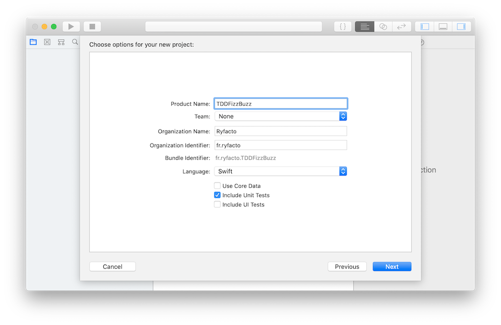
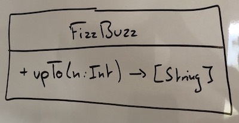

Dans [l'article précédent](construire-une-architecture-emergente), je te parlais de l'importance des tests pour faire émerger l'architecture.

J'évoquais aussi le fait que [TDD permet d'être plus productif](construire-une-architecture-emergente#automatiser-les-tests) en combattant l'idée reçue "Écrire des tests revient à écrire plus de code, donc c'est plus lent".

> Tu m'as convaincu que TDD était LA pratique à apprendre. Mais comment je fais concrètement ?

Je vais te le montrer à travers cet article justement !

Nous allons entrer dans le vif du sujet avec une approche par l'exemple comme l'a fait Kent Beck (le papa de TDD) le 8 novembre 2002 (17 ans déjà !) lorsqu'il a publié son livre ["Test-Driven Development by Example"](https://amzn.to/2l8qHa3).

<!--more-->

## FizzBuzz

Le premier exemple se base sur un kata de code, le kata ["FizzBuzz"](http://kata-log.rocks/fizz-buzz-kata).

J'ai volontairement choisi un premier exemple qui ne reflète pas la réalité de ton quotidien pour que tu puisses te concentrer sur la pratique du TDD.

### Énoncé

- Écris un programme qui affiche une ligne pour chaque nombre de 1 à 100.
- Pour les multiples de `3`, affiche `Fizz` au lieu du nombre.
- Pour les multiples de `5`, affiche `Buzz` au lieu du nombre.
- Pour les nombres qui sont à la fois des multiples de `3` et de `5`, affiche `FizzBuzz` au lieu du nombre.

Prêt à relever le défi ? C'est parti ! 💪

## Étape 0 : je prépare mon environnement

Qui dit écrire des tests, dit pouvoir les lancer !

Je commence par créer le projet : une app iOS "Single View App" avec des tests unitaires que j'appelle `TDDFizzBuzz`.

Je vérifie ensuite que mes tests s'exécutent correctement à l'aide d'un petit `⌘U` dans Xcode.

Je t'invite à [télécharger le projet de départ](tdd-intro-resources/code/TDDFizzBuzz.zip). Comme ça tu pourras faire les différentes étapes avec moi.

Pour cet exemple je vais exécuter les tests au sein de l'app.

Le problème c'est que ce n'est pas performant lorsque l'on écrit des tests pour une véritable app.

Je te montrerai dans le prochain article (où nous allons créer une véritable app iOS en TDD), comment faire pour exécuter les tests indépendamment de l'app. [Inscris-toi à la newsletter](signup) pour ne pas le louper !

## Étape 1 : quels sont les comportements attendus ?

> Whaaaaat ? Je croyais que la première étape de TDD était le test rouge ! Mais là tu...

Hola, hola ! Du calme mon ami(e) !

Je me permets une petite aparté.

Bien que TDD existe depuis longtemps et soit très bien documenté par Kent Beck dans son livre.

Il s'avère que c'est une pratique qui a été interprétée, détournée, galvaudée, et j'en passe.

Je tiens à revenir aux idées originales présentées dans le livre.

Et il se trouve, aussi étonamment que cela puisse paraître, que la première chose à faire selon l'auteur soit de lister les __comportements__ attendus.

J'insiste bien sur le terme __comportement__.

En d'autres termes, quels sont les tests à écrire pour spécifier ces comportements ?

_Je t'invite à faire l'exercice de ton côté. Liste tous les tests (comportements !) pour `FizzBuzz`._

...

...

...

C'est bon ?

Voici ma liste :

<table>
  <tr><td>100 -> [1, 2, Fizz, 4, Buzz, Fizz, ... ]</td></tr>
  <tr><td>creation</td></tr>
  <tr><td>3 -> [1, 2, Fizz]</td></tr>
  <tr><td>5 -> last == Buzz</td></tr>
  <tr><td>15 -> last == FizzBuzz</td></tr>
  <tr><td>0 -> []</td></tr>
  <tr><td>-1 -> []</td></tr>
  <tr><td>1 -> [1]</td></tr>
</table>

J'ai pour habitude d'écrire cette liste en commentaire dans le code de la classe de test que je suis en train d'écrire.

Le plus important est d'avoir cette liste sous les yeux car nous allons la mettre à jour continuellement quand d'autres tests nous viendront en tête ou quand nous aurons fini d'écrire un test.

## Étape 2 : dans quel ordre j'écris les tests ?

J'utilise un algorithme simple pour déterminer l'ordre de priorité.

1. Quel test me fera écrire le moins de code ? Autrement dit, quel est le test le plus simple à faire passer ?
2. Ai-je des cas à la marge à gérer ? Exemple : string vide, valeurs nil, liste vide, etc.

_À toi de jouer ! Priorise ta liste._

...

...

...

Job done ?

Moi oui ! Voici ma liste priorisée avec quelques explications :

<table>
  <thead><tr><th>Test</th><th>Pourquoi ?</th></tr></thead>
  <tr><td>creation</td><td>Me poussera à simplement créer le type.</td></tr>
  <tr><td>0 -> []</td><td>Cas à la marge</td></tr>
  <tr><td>-1 -> []</td><td>Cas à la marge</td></tr>
  <tr><td>1 -> [1]</td><td>Cas simple : afficher le numéro sous forme de string</td></tr>
  <tr><td>3 -> [1, 2, Fizz]</td><td>Première règle métier</td></tr>
  <tr><td>5 -> last == Buzz</td><td>Deuxième règle métier</td></tr>
  <tr><td>15 -> last == FizzBuzz</td><td>Troisième règle métier</td></tr>
  <tr><td>100 -> [1, 2, Fizz, 4, Buzz, Fizz, ... ]</td><td>Test d'acceptance</td></tr>
</table>

> Pourquoi commencer par les tests les plus simples et ceux à la marge ?

Très bonne question !

Si je commence par les tests concernant les règles métiers, je risque de me retrouver bloquer.

Je risque de devoir implémenter tout l'algo, ou une grosse partie, d'un coup !

Dans un prochain article, je te montrerai un exemple qui illustre un blocage si on ne priorise pas correctement. Pour ne pas le rater, [inscris-toi à la newsletter !](signup)

## Étape 3 : un peu de conception

Qui a dit que TDD voulait dire foncer tête baissée sans concevoir ?

Cette phase est très importante.

J'imagine l'API (Application Programming Interface) la plus simple possible qui me permettra d'écrire les premiers tests.

Je peux faire cette exercice dans ma tête ou sur tableau blanc.

Je peux en discuter avec mon pair si je travaille en pair programming.

_Je t'invite à concevoir cette API avant de continuer ta lecture._

...

...

...

Voici ce que j'ai imaginé, sur tableau blanc en utilisant un peu d'UML.

## Étape 4 : le premier test rouge (RED)

> Enfin !

Le suspens était à son comble mais nous y sommes !

L'écriture du premier test rouge !

### Le test marche-pied de "création"

Si ce n'est pas déjà fait, [télécharge le projet de départ](tdd-intro-resources/code/TDDFizzBuzz.zip).

Afin de bien démarrer, supprime le fichier __TDDFizzBuzzTests.swift__ qui servait simplement à vérifier l'environnement.

Crée ensuite un groupe __FizzBuzz__ dans le groupe __TDDFizzBuzz__.

Crée ensuite le premier fichier de test __FizzBuzz_Spec.swift__ dans le groupe __FizzBuzz__ et veille bien à l'ajouter à la target __TDDFizzBuzzTests__.

_(Pour je ne sais quelle raison, Xcode propose de créer un Bridging Header. Réponds "Don't create" et tout ira bien !)_

Ensuite écris le code suivant dans __FizzBuzz_Spec.swift__ :


import XCTest
@testable import TDDFizzBuzz

class FizzBuzz_Spec: XCTestCase {

}


Et enfin le premier test à l'intérieur de la classe __FizzBuzz_Spec__ :


func test_Creation() {
  _ = FizzBuzz()
}


> Ça ne compile même pas !

Parfait ! Un code qui ne compile pas équivaut à un test qui échoue.

C'est la phase __RED__ de TDD. J'écris d'abord un test qui échoue.

J'utilise ici un type qui n'existe pas encore, ça s'appelle _"Programming with wishful thinking"_.

Cela nous aide à concevoir les API les plus simples possibles et à valider notre conception initiale.

## Étape 5 : je fais passer le test le plus vite possible (GREEN)

Fais passer le test en créant une `struct` __FizzBuzz__ juste au-dessus de la classe de test dans le fichier __FizzBuzz_Spec.swift__.


struct FizzBuzz {

}


Relance le test avec `⌘U`.

Il passe ! C'est la phase __GREEN__ de TDD : je fais passer le test le plus vite possible.

> Il est un peu inutile ce test non ?

Il peut sembler inutile, il n'empêche qu'il m'a poussé à créer la `struct`, il m'a permis de mettre le pied à l'étrier.

Il m'a permis...de progresser !

C'est un test que l'on appelle "test marche-pied".

En TDD, tu peux avancer par petites étapes, les anglophones parlent de "baby steps".

Pour autant, ce n'est pas parce que tu peux le faire que tu vas toujours le faire.

Il m'arrive de sauter ce test pour aller plus vite.

Ce n'est pas "interdit" par la pratique de TDD.

Mais je sais que si je le souhaite, je peux ralentir pour y aller plus progressivement.

## Étape 6 (ma préférée) : j'améliore la structure ! (REFACTORING)

Posons-nous la question suivante : _quelles crimes de conception avons-nous commis ?_

> Sur un code si simple, avons-nous vraiment commis des crimes de conception ?

Oui, un petit crime en réalité. 😉

Je te laisse un petit temps de reflexion.

...

...

...

Alors ?

> Ah je sais ! `FizzBuzz` est inutilisable dans le code de production puisqu'elle est dans le fichier de test !

Exactement ! Bien joué !

Du coup, comment règle-t-on le soucis ?

> On crée un nouveau fichier pour y mettre `FizzBuzz`.

Parfait !

Crée le fichier __FizzBuzz.swift__ juste à côté du fichier de test.

Maintenant déplace la `struct FizzBuzz` dans ce fichier et relance les tests.

## Étape 7 : je mets à jour la liste

J'ai fini d'écrire le premier test, je peux donc mettre à jour la liste en retirant ce test.

<table>
  <tr><td>0 -> []</td></tr>
  <tr><td>-1 -> []</td></tr>
  <tr><td>1 -> [1]</td></tr>
  <tr><td>3 -> [1, 2, Fizz]</td></tr>
  <tr><td>5 -> last == Buzz</td></tr>
  <tr><td>15 -> last == FizzBuzz</td></tr>
  <tr><td>100 -> [1, 2, Fizz, 4, Buzz, Fizz, ... ]</td></tr>
</table>

🎉 Tu viens de terminer ton premier cycle TDD, bravo !

Résumons :
- étape 1 : je crée ou mets à jour la liste des __comportements attendus__,
- étape 2 : j'ordonne la liste en commençant par les tests les plus simples (ceux qui me feront écrire le moins de code) ainsi que les cas à la marge ; pour éviter de me retrouver bloquer,
- étape 3 : je fais juste assez de conception pour m'aider à écrire les tests, et surtout le premier,
- étape 4 : j'écris le premier test en utilisant du code qui n'existe pas, c'est la phase __RED__,
- étape 5 : je fais passer le test sans me préoccuper des horreurs de conception que je fais, c'est la phase __GREEN__,
- étape 6 : je nettoie les dites horreurs, c'est la phase __REFACTORING__,
- étape 7 : je mets à jour ma liste et je recommence tant qu'elle n'est pas vide !

> Pourquoi ne pas écrire directement du code bien conçu ?

Certains pratiquants du TDD le font.

Il m'arrive aussi de le faire de temps en temps.

Il faut cependant avoir conscience que vouloir _"faire correctement tout de suite"_ c'est prendre le risque de faire de la sur-ingénierie, d'écrire du code au cas où, du code qui n'est pas requis par un test qui échoue.

Et puis, c'est plus difficile de faire _bien_ tout de suite.

J'aime bien cette idée d'aller très vite en __GREEN__ sans se préoccuper de la conception.

Puis dans la phase de __REFACTORING__ prendre du recul, de la hauteur et vraiment me concentrer sur la bonne conception.

Si tu débutes en TDD, je t'encourage vivement à y aller doucement.

## Et le cycle recommence !

### FizzBuzz "jusqu'à 0"

Modifie __FizzBuzz_Spec.swift__ pour y ajouter ce test :


func test_FizzBuzz_up_to_0_is_an_empty_list() {
  let fizzBuzz = FizzBuzz()
  let result = fizzBuzz.upTo(0)
  let expected: [String] = []
  XCTAssertEqual(expected, result)
}


Lance les tests. Erreur de compilation !

Ajoute la méthode `upTo` à `FizzBuzz`.


func upTo(_ n: Int) -> [String] {
  fatalError("upTo(n:) has not been implemented")
}


Relance les tests. Échec à nouveau, quelle tristesse !

Non, un test qui échoue c'est du progrès !

Aller, on ne se décourage pas, on fait passer le test le plus vite possible !

Met à jour la méthode `upTo` :


func upTo(_ n: Int) -> [String] {
  return []
}


Et relance les tests une nouvelle fois (tu comprends maintenant pourquoi ils doivent être rapide !).

Ils passent !

> Youpi ! Test suivant !

Hum hum...

> ...je voulais dire : refactoring !

Ah ! Je préfère ça !

> Quels crimes avons-nous commis ?

J'allais te le demander !

> Je regarde le code dans `FizzBuzz`, ça m'a l'air très bien, je ne vois pas quoi améliorer...

Et dans les tests ?

> Quoi ? On doit aussi refactorer les tests ?

Et comment ! C'est encore plus important que le code de production !

Les tests sont-ils bien conçus selon toi ?

Y'a-t-il de la duplication ?

...

...

...

> Oh c'est difficile, je ne sais pas !

Ok ok je vais t'aider !

Il y a un test qui est devenu inutile...

...notre test "marche-pied" !

Tu peux donc le supprimer, il s'agit de la méthode `test_Creation`. _Whoop! Supprimée!_

> Ensuite on met à jour la liste !

Extact !

<table>
  <tr><td>-1 -> []</td></tr>
  <tr><td>1 -> [1]</td></tr>
  <tr><td>3 -> [1, 2, Fizz]</td></tr>
  <tr><td>5 -> last == Buzz</td></tr>
  <tr><td>15 -> last == FizzBuzz</td></tr>
  <tr><td>100 -> [1, 2, Fizz, 4, Buzz, Fizz, ... ]</td></tr>
</table>

### FizzBuzz "jusqu'à -1"

Je me pose la question si je dois réellement écrire un test pour celui-ci.

Ne pourrais-je pas gérer ce cas marginal autrement ?

À ton avis ?

...

...

...

> Le compilateur ! On met un `UInt` au lieu d'un `Int` pour le paramètre `n` !

Euréka ! Très bonne idée !

Modifie la méthode `upTo` comme ceci :


func upTo(_ n: UInt) -> [String] {
  return []
}


Relance les tests pour être sûr.

Ça marche toujours !

On vient de s'épargner un test, donc du code à maintenir, génial ! Merci le système de type !

<table>
  <tr><td>1 -> [1]</td></tr>
  <tr><td>3 -> [1, 2, Fizz]</td></tr>
  <tr><td>5 -> last == Buzz</td></tr>
  <tr><td>15 -> last == FizzBuzz</td></tr>
  <tr><td>100 -> [1, 2, Fizz, 4, Buzz, Fizz, ... ]</td></tr>
</table>

### FizzBuzz "jusqu'à 1"

Ajoute le test suivant :


func test_FizzBuzz_up_to_1_is_a_list_containing_1_as_string() {
  let fizzBuzz = FizzBuzz()
  let result = fizzBuzz.upTo(1)
  let expected = [ "1" ]
  XCTAssertEqual(expected, result)
}


Lance les tests. Le dernier échoue !

Modifie le code pour le faire passer :


func upTo(_ n: UInt) -> [String] {
  if n == 0 {
    return []
  }

  return [ "1" ]
}


Relance les tests. Ils passent !

> REFACTORING !!!

WOW! Oui c'est ça haha !

> Y'a une duplication ! C'est pô bien !

Effectivement, le `"1"` est dupliqué !

Il est présent dans le code de test, et dans le code de production.

Nous sommes donc forcés de le supprimer à un des deux endroits et de le remplacer par autre chose sans rien casser.

Nous allons __généraliser__ le code de production pour supprimer la duplication sans rien casser.

> Comment ça "généraliser" ?

Généraliser revient à supprimer ce qui est spécifique, ici `"1"` en utilisant des variables.

Quelle variable peux-tu utiliser dans ce cas précis pour remplacer `"1"` dans la méthode `upTo` ?

...

...

...

> `n` !

C'est ça ! Modifie le code de `upTo` comme ceci :


func upTo(_ n: UInt) -> [String] {
  if n == 0 {
    return []
  }

  return [ "\(n)" ]
}


Relance les tests. Ils passent toujours !

Ceci est très intéressant et illustre une des propriétés des __bons tests__.

  Au fur et à mesure que les tests deviennent <strong>spécifiques</strong>, le code de production devient <strong>générique</strong>.

Il y a encore de la duplication, mais dans les tests cette fois.

Simplifions les grâce à trois refactorings : [_extract variable_](https://refactoring.guru/extract-variable), [_extract method_](https://refactoring.guru/extract-method) et [_inline temp_](https://refactoring.guru/inline-temp).

Premièrement fais un _extract variable_ des paramètres en entrée de `upTo` dans les deux tests :


func test_FizzBuzz_up_to_0_is_an_empty_list() {
  // ...
  let input: UInt = 0
  let result = fizzBuzz.upTo(input)
  // ...
}

func test_FizzBuzz_up_to_1_is_a_list_containing_1_as_string() {
  // ...
  let input: UInt = 1
  let result = fizzBuzz.upTo(input)
  // ...
}


Ensuite, fais remonter les variables `input` et `expected` en haut de chaque méthode de test :


func test_FizzBuzz_up_to_0_is_an_empty_list() {
  let input: UInt = 0
  let expected: [String] = []
  // ...
}

func test_FizzBuzz_up_to_1_is_a_list_containing_1_as_string() {
  let input: UInt = 1
  let expected = [ "1" ]
  // ...
}


Et enfin un _extract method_ des trois dernières lignes :


func test_FizzBuzz_up_to_0_is_an_empty_list() {
  let input: UInt = 0
  let expected: [String] = []
  assertThatFizzBuzz(upTo: input, is: expected)
}

func test_FizzBuzz_up_to_1_is_a_list_containing_1_as_string() {
  let input: UInt = 1
  let expected = [ "1" ]
  assertThatFizzBuzz(upTo: input, is: expected)
}

// 1.
private func assertThatFizzBuzz(upTo n: UInt, is expected: [String], line: UInt = #line) {
  let fizzBuzz = FizzBuzz()
  let result = fizzBuzz.upTo(n)
  XCTAssertEqual(expected, result, line: line)
}


1. Tu noteras que j'ai ajouté un paramètre `line`, avec la valeur spéciale `#line`. Cela permet d'indiquer à Xcode à quelle ligne aller lorsque l'assertion échoue et que l'on clique sur le test qui a échoué. Sans ce paramètre, Xcode nous emmènerait dans la méthode `assertThatFizzBuzz...` et on devrait aller nous-même dans le code appelant la méthode. Ce qui est très ennuyeux !

Et enfin, ultime étape, tu peux _inline temp_ les variables `input` & `expected` :


func test_FizzBuzz_up_to_0_is_an_empty_list() {
  assertThatFizzBuzz(upTo: 0, is: [])
}

func test_FizzBuzz_up_to_1_is_a_list_containing_1_as_string() {
  assertThatFizzBuzz(upTo: 1, is: [ "1" ])
}

private func assertThatFizzBuzz(upTo n: UInt, is expected: [String], line: UInt = #line) {
  let fizzBuzz = FizzBuzz()
  let result = fizzBuzz.upTo(n)
  XCTAssertEqual(expected, result, line: line)
}


Un petit run des tests pour vérifier qu'on n'a rien cassé au passage...

...et ça marche ! Merveilleux !
